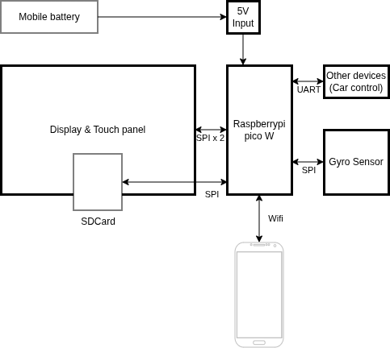
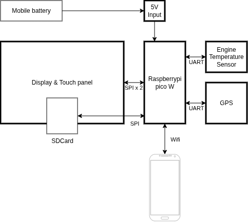

# 2024-logger-frontpanel
This is the source code for Ecorun Logging system of front panel. This system is using since 2024.

## INVENTORY
- raspberrypi pico w
- [touch screen with ILI9341 display controller and XPT2046 touchpanel controller](https://akizukidenshi.com/catalog/g/g116265/)
- and SD card slot (2024(disabled))
- [BNO055 9-axis gyro sensor](https://akizukidenshi.com/catalog/g/g116996/) (2024)
- [GPS Module](https://akizukidenshi.com/catalog/g/g117980/) (2025, 2026(planned))

## How to use?
Please copy `main.py`, `hardware_setup.py`, `lib/` to Raspberrypi pico (micropython installed)'s root.

## System Overview
### 2024 Overview

### 2025 Overview

